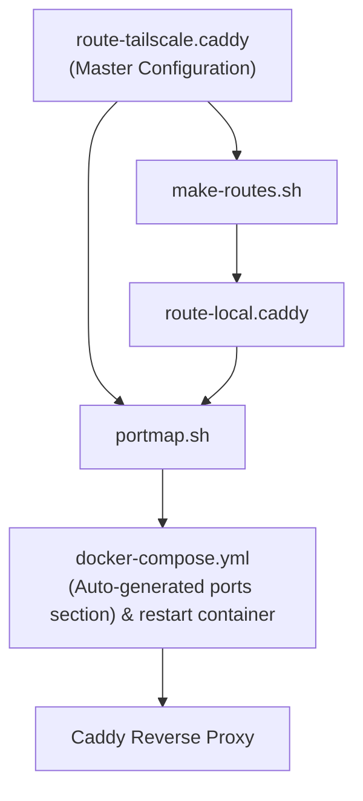
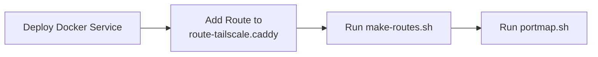

If you've been self-hosting for a while, you've probably run into this at least once.

You spin up a new Docker service, publish a port in `docker-compose.yml`, add a route to your reverse proxy, and move on. A few weeks later, you remove the service—but forget to remove the published port. Repeat that enough times, and you end up with a collection of stale port mappings that no longer serve any purpose.

```yaml
ports:
  - "80:80"
  - "443:443"

  - "50000:50000"
  - "30000:30000"
  - "50001:50001"
  - "30001:30001"
  - "50002:50002"
  - "50003:50003"
  - "30003:30003"
  - "50010:50010"
  - "30010:30010"
  - "50014:50014"
  - "50021:50021"
  - "30026:30026"
  - "50034:50034"
```

That was exactly the problem I found myself facing. I had no clue, which one of these was the experiments that I had long ago abandoned, which were old services that I had removed, and which ones were actually still in service.

I run my homelab on a Raspberry Pi 5, and while it's surprisingly capable, I still prefer to keep my stack as lean as possible. I also wanted a workflow that was predictable. Every exposed service should exist because I explicitly declared it, not because a container happened to have the right labels.

I looked at solutions like Traefik and Caddy Docker Proxy, but they solved a different problem than the one I had. They optimize for automatic discovery. I was looking for control, and multi routing (LAN + Tailscale)

So I built a small workflow around Caddy that solved four problems for me:

- A single source of truth for every exposed service.
- Clean `docker-compose.yml` files that know nothing about reverse proxy configuration.
- Multiple routes for the same service (local, Tailscale, and potentially more in the future).
- Automatic synchronization of published Docker ports.
    
Maybe it'll fit your homelab too.

---

# The Design Goals

Before writing a single line of code, I wrote down what I actually wanted from the system.

## Keep the stack lightweight

This entire setup runs on a Raspberry Pi 5. While the hardware is more than capable of running Docker and Caddy, I didn't want to introduce additional services unless they provided significant value.

Caddy should remain exactly what it is—a reverse proxy.

No extra management containers. No background watchers.

Just configuration files and a couple of lightweight scripts.

---

## Separate application deployment from networking

I wanted my application Compose files to describe applications—and nothing else.

Things like:

- reverse proxy routes,
- authentication,
- published ports,
- and networking policies

shouldn't live alongside the application itself.

That separation makes moving services between hosts much easier, and I don't need to touch ten different Compose files when changing how traffic reaches a service.

---

## Support multiple routes per service

Some of my services are only accessible over Tailscale.

Others should also be available locally.

Some available over both.

Having a local endpoint isn't just about convenience—it also means that if my ISP or Tailscale is unavailable, I can still access my services from inside my home network (at least). External connectivity shouldn't become a single point of failure for services that never leave my LAN.

Tomorrow I might decide to expose services another way (CloudFlare, NetBird, etc...). I wanted a workflow that could grow without needing to redesign everything.

---

## Keep everything explicit

I wanted one file that answered a simple question:

> **What services are exposed? How & Where?**

If a service exists there, it's available with details. If it doesn't, it isn't.

Simple.

---

# The Workflow

The entire workflow revolves around three small pieces.



Everything starts with a single master Caddyfile.

From that file, everything else is generated automatically.

---

# The Master Caddyfile

Instead of treating my Caddyfile as just another configuration file, I made it the source of truth for the rest of the workflow.

A few simple comment markers tell my scripts whether a service should: (to be placed right after the row of # characters, placed on the next line for readability)

- generate a local route - `!`
- generate a local route protected with Basic Authentication - `:` (last 4 digits of the port is the password used in this example)
- or remain Tailscale-only - `;`

That means I only ever edit one file.

**Example**

```conf
############################################################################################# 
AudiobookShelf: 50030
https://my.tailscale.ts.net:50030 {...} # Generates local route with authentication

############################################################################################# 
PgAdmin; 50031
https://my.tailscale.ts.net:50031 {...} # Tailscale only route

############################################################################################# 
CalibreWeb! 50032
https://my.tailscale.ts.net:50032 {...} # Generates local route without authentication
```

---

# Generating Local Routes

The first script, `make-routes.sh`, reads the master Caddyfile and generates a second one dedicated to local access.

<details> <summary> Github Gist </summary>
<script src="https://gist.github.com/ujwalnk/5a9724ac80036452a2178db4f41c9933.js"></script>
</details> <br/>


During that process it:

- converts external ports into local ports
- removes TLS directives where required
- injects Basic Authentication when required
- and skips services that should remain Tailscale-only

The result is a second Caddyfile that never needs to be edited manually.

**Generated Output**

```conf
#############################################################################################
AudiobookShelf : 30030
http://:30030 {
    basicauth {
        admin $2a$...
    } 
    ...
}

#############################################################################################
CalibreWeb : 30032
http://:30032 {...}
```

Notice that:
- AudiobookShelf has **basic auth** in the second file (Will be exposed on the local network with HTTP Authentication)
- PgAdmin is **not** present in the second file (Will not be exposed on the local network)
- CalibreWeb is present in the second file, but **lacks auth** (Will be exposed on the local network)
- The ports have been changed from 50000 series 30000 series, to avoid port conflicts

---

# Keeping Docker Ports in Sync

The second script, `portmap.sh`, solves the problem that started this entire project.

<details> <summary> Github Gist </summary>
<script src="https://gist.github.com/ujwalnk/f04d34417bc8b77f587fe6a5ebacaa95.js"></script>
</details> <br/>

Instead of manually publishing ports inside `docker-compose.yml`, it scans every generated Caddy route, collects the ports that are actually in use, and updates a dedicated section inside my Compose file.

If I remove a route, the published port disappears automatically.
No stale configuration.
No forgotten ports.
No manual cleanup.


<div class="row" markdown="1">
  <div class="col-md-6" markdown="1">

```yaml
services:
  caddy:
    image: caddy:latest

    # ...

    ports:
    - 80:80
    - 443:443

    # ===== AUTO-GENERATED PORTS (DO NOT EDIT MANUALLY) =====
    # ===== END AUTO-GENERATED PORTS =====

    stop_grace_period: 10s


```
  </div>
  <div class="col-md-6" markdown="1">

```yaml
services:
  caddy:
    image: caddy:latest

    # ...

    ports:
    - 80:80
    - 443:443

    # ===== AUTO-GENERATED PORTS (DO NOT EDIT MANUALLY) =====
    - 50030:50030 # AudiobookShelf
    - 30030:30030 # AudiobookShelf
    - 30032:30032 # CalibreWeb
    - 50032:50032 # CalibreWeb
    - 50031:50031 # PgAdmin
    # ===== END AUTO-GENERATED PORTS =====

    stop_grace_period: 10s
```

  </div>
</div>

---

## A Couple of Handy Flags

Now here's the thing — once you've got a dozen-odd services running, you'll eventually forget which port you gave to what. Was AdventureLog on 50021 or 50012? Happens to me all the time, honestly.

So `portmap.sh` isn't just a sync-and-forget script. I threw in a query mode for exactly this situation.

```bash
./portmap.sh -q calibre
```

This does a case-insensitive, partial match search across all your `route-*.caddy` files and just tells you straight up:

```
CalibreWeb → 50032 (route-tailscale.caddy)
CalibreWeb → 30032 (route-local.caddy)
```

No need to grep through files or scroll up and down the Caddyfile trying to remember your own naming. You just ask, and it answers. Pretty neat for something so small.

There's also a `-r` flag, which is basically the "I trust this, just do it" option:

```bash
./portmap.sh -r
```

Instead of syncing the ports and leaving you to restart Caddy yourself, this one goes ahead and recreates the container right after — `docker compose up -d --force-recreate` under the hood. Good for when you're actively adding a service and don't want the extra step of remembering to reload things after.

One small catch — you can't use `-q` and `-r` together, and that's on purpose. One's for looking things up, the other's for actually changing your running setup. Mixing the two felt like asking for trouble, so the script just refuses and tells you to pick one.

---

# Adding a New Service

Once everything is in place, adding a service becomes surprisingly simple.



Every new service follows exactly the same process.

Likewise, removing one is just the reverse: delete the route, rerun the scripts, and the configuration cleans itself up.

---

# Is This Better Than Traefik or Caddy Docker Proxy?

Probably not.

It's simply solving a different problem.

If you like automatic service discovery, Docker labels, and infrastructure that configures itself, those tools are excellent choices. I just wanted something different.

My priority wasn't maximum automation—it was having a workflow that's easy to understand six months later. Every exposed service is explicitly declared.

My application Compose files stay focused on applications. The reverse proxy stays focused on routing. And I only ever edit one file when exposing something new.

For me, that's a trade-off worth making.

---

# Source Code

The complete implementation, including both helper scripts, is available on GitHub.

**GitHub Gists:** https://gist.github.com/ujwalnk/5a9724ac80036452a2178db4f41c9933, https://gist.github.com/ujwalnk/f04d34417bc8b77f587fe6a5ebacaa95

---

# Closing Thoughts

One of my favorite things about self-hosting is that there isn't a single "right" way to build a homelab. The best solution is often the one that fits the way _you_ think.

This workflow probably isn't for everyone. If you're managing dozens of servers where automatic service discovery is a necessity, tools like Traefik or Caddy Docker Proxy make perfect sense.

But if you enjoy explicit configuration, prefer keeping your Compose files clean, and like having a single place that defines everything your reverse proxy exposes, this approach might give you a few ideas.

Even if you don't adopt it exactly, I hope it encourages you to build workflows that match your own priorities instead of defaulting to the most automated option available.